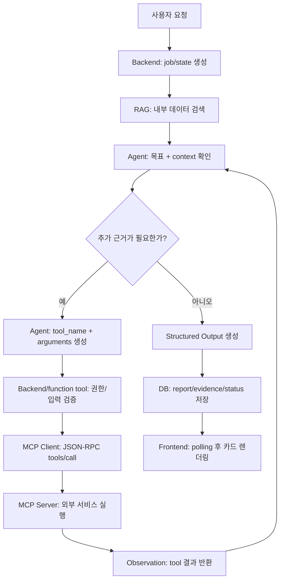

# ProjectLens AI 파트 코어타임 개념·구현 참고문서

> 읽기형 개념·구현 참고문서 v4.  
> 목적은 ProjectLens 서비스를 소개하는 것이 아니라, 과제의 AI 필수 요구사항인 RAG, MCP, AI Agent를 이해하고 구현 판단 기준을 잡아주는 것이다.  

---

## 0. 문서 목적: 핵심 개념과, 세부는 구현 참고

이 문서는 두 겹으로 읽도록 만든다.

```text
개념 이해용:
RAG, MCP, Agent의 본질과 통합 루프를 이해한다.

구현 참고용:
나중에 직접 만들 때 어떤 선택지를 잡아야 하는지 표로 확인한다.
```

가장 중요한 메시지는 이것이다.

```text
RAG는 내부 데이터 검색,
MCP는 외부 시스템 호출,
Agent는 상태와 루프를 가진 도구 선택 시스템이다.
```

ProjectLens는 이 세 개념을 보여주는 예시일 뿐이다. 중심은 "내 서비스 설명"이 아니라 "과제에서 요구하는 AI 활용 기능을 어떻게 이해하고 구현할 것인가"다.

### 문서를 읽을 때 지킬 원칙

- 개념을 먼저 말한다.
- 과제 요구와 연결한다.
- Agent 루프를 시각적으로 보여준다.
- ProjectLens는 짧은 구현 예시로만 쓴다.
- 구현 표와 코드 snippet은 필요할 때 다시 찾아보는 참고 영역으로 둔다.
- Notion 이미지는 만료 URL을 넣지 않고, 문서화나 시각자료 정리 시 다시 가져올 이미지 자리만 표시한다.

### 추천 읽기 순서

처음 읽을 때는 1~4장을 먼저 읽어 RAG, MCP, Agent가 어떻게 하나의 루프로 이어지는지 잡는다.  
구현을 시작할 때는 5~10장을 체크리스트처럼 다시 보면서 데이터 저장, tool schema, 상태 관리, 비용 제한을 확인한다.  
마지막으로 11~13장은 개념을 말로 정리하거나 구현 결정을 검토할 때 참고한다.

### 구현 참고로 볼 때의 기준

이 문서에서 ProjectLens 코드는 정답 템플릿이 아니라 기준 사례다.  
다른 프로젝트에 옮길 때는 아래 계약이 유지되는지만 확인하면 된다.

| 기준 | 확인할 것 |
| --- | --- |
| RAG | 내 데이터가 embedding/vector DB에 저장되고, 검색 결과가 LLM context와 출처로 연결되는가? |
| MCP | 외부 기능이 tool schema로 노출되고, Host/Client 경로에서 권한과 입력 검증을 통제하는가? |
| Agent | 모델이 tool 사용 여부를 판단하고, observation을 반영해 최종 structured output을 만드는가? |
| 보안 | 외부 텍스트는 instruction이 아니라 evidence로만 다루고, secret/URL/로그 경계를 지키는가? |
| 운영 | 실패, 지연, 재시도, 비용, rate limit을 상태와 로그로 확인할 수 있는가? |

### ProjectLens에서 OpenAI SDK를 쓰는 방식

ProjectLens는 OpenAI SDK를 쓴다.  
정확히는 두 갈래로 나뉜다.

| 구분 | 역할 | ProjectLens에서의 쓰임 |
| --- | --- | --- |
| OpenAI Agents SDK | Agent 실행 구조 | `Agent`, `Runner`, `function_tool`로 분석 루프를 만든다. |
| OpenAI Python SDK | OpenAI API 직접 호출 | 게시글과 리포트 embedding을 만들 때 쓴다. |

전체 흐름은 이렇게 이해하면 된다.

```text
게시글 입력
-> RAG 임베딩 / 유사 프로젝트 검색
-> Agents SDK Runner 실행
-> Agent가 function_tool로 local/private MCP 도구 호출
-> ProjectAnalysisReport 구조화 출력
-> ai_reports / mcp_evidences / embeddings 저장
```

여기서 중요한 점은 MCP 방식이다.  
ProjectLens는 OpenAI hosted MCP를 바로 쓰는 형태가 아니라, 우리가 만든 `mcp-server/`를 local/private MCP로 띄우고, Agents SDK의 `function_tool`이 그 도구들을 감싸서 호출하는 구조다.  
그래서 URL fetch 보안, SSRF 차단, evidence 로그 저장, 실패 UX는 OpenAI가 아니라 우리 백엔드가 책임진다.

OpenAI Agents SDK가 "절대 안 쓰면 안 되는 필수 조건"은 아니다.  
직접 Responses API 호출과 function calling loop를 만들거나, LangGraph 같은 다른 agentic framework로도 비슷한 구조를 만들 수 있다.  
다만 ProjectLens에서는 Agent 루프, 도구 호출, Structured Output, trace/usage 저장, `max_turns` 같은 안전장치를 한 흐름으로 묶기 위해 Agents SDK를 중심 부품으로 선택했다.

API key가 없을 때도 로컬 검증이 완전히 막히지는 않는다.  
분석은 mock runner로, embedding은 fake embedding으로 떨어지게 해 두었다.  
하지만 실제 품질 검증, 실제 모델 응답, 실제 비용/지연 확인은 OpenAI API key가 있을 때만 가능하다.

---

## 1. 세 개념 먼저 이해하기: RAG, MCP, Agent

### 1.1 RAG: LLM과 내 데이터를 연결하는 검색 구조

RAG는 Retrieval-Augmented Generation이다.  
말 그대로 "검색으로 보강된 생성"이다.

LLM은 사전학습된 지식만으로 답하면 최신 정보, 사내 문서, 개인 데이터, 우리 서비스 DB를 모른다. RAG는 이 문제를 모델 재학습으로 풀지 않고, 외부 저장소에서 관련 문서를 검색해 현재 질문의 context로 넣는다.

Notion RAG 페이지의 핵심은 이 흐름이다.

```text
indexing:
문서 / DB / 웹페이지 / 매뉴얼
-> 작은 chunk로 나눔
-> embedding vector로 변환
-> vector DB에 저장

retrieval + generation:
사용자 질문
-> 질문 embedding 생성
-> vector DB에서 의미가 가까운 chunk 검색
-> 검색 결과를 context에 추가
-> LLM이 근거를 보고 답변 생성
```

개념 핵심:

```text
RAG는 AI에게 데이터를 새로 학습시키는 것이 아니라,
필요한 순간에 관련 데이터를 검색해서 읽게 만드는 방식입니다.
```

오해와 정확한 설명:

| 오해 | 정확한 설명 |
| --- | --- |
| "우리 데이터를 AI에게 학습시켰다" | 모델 파라미터를 바꾼 것이 아니라, 외부 저장소에서 관련 문서를 검색해 context에 넣은 것이다. |
| "프롬프트에 긴 문서를 붙이면 RAG다" | 검색 계층 없이 전부 붙이는 것은 RAG의 핵심인 retrieval이 약하다. |
| "RAG를 쓰면 정답이 보장된다" | 검색 품질, 문서 품질, prompt, 모델의 지시 준수, 검증 장치가 함께 좋아야 한다. |

Notion 이미지 참고 자리:

```text
이미지 자리: RAG indexing -> retrieval -> generation 흐름
출처: Notion [JUNGLE] AI로 진화하기 / RAG
문서 사용 의도: "학습이 아니라 검색해서 읽게 한다"를 한 장으로 보여주기
```

ProjectLens 예시:

```text
ProjectLens는 게시글과 AI 리포트를 embedding으로 저장하고,
새 게시글과 의미적으로 가까운 기존 글을 찾아 Agent에게 참고 근거로 준다.
```

### 1.2 MCP: AI 앱과 외부 시스템을 잇는 표준 연결 방식

MCP는 Model Context Protocol이다.  
외부 API를 없애는 기술이 아니라, AI Agent가 외부 데이터와 도구를 표준화된 방식으로 발견하고 호출할 수 있게 만드는 연결 계층이다.

Notion MCP 페이지의 가장 좋은 비유는 USB-C다.

```text
USB-C = 주변기기를 공통 규격으로 연결
MCP = AI 앱과 외부 데이터/도구를 공통 규격으로 연결
```

MCP의 기본 구조는 이렇게 이해하면 된다.

```text
MCP Host
  ├─ MCP Client ── JSON-RPC 2.0 ── MCP Server: GitHub
  ├─ MCP Client ── JSON-RPC 2.0 ── MCP Server: DB
  └─ MCP Client ── JSON-RPC 2.0 ── MCP Server: Email
```

역할 구분:

| 구성 | 역할 |
| --- | --- |
| LLM | 어떤 tool을 쓸지 판단하고 `tool_name + arguments`를 만든다. |
| Host | 전체 AI 앱을 운영하고 권한, 승인, context 전달을 관리한다. |
| MCP Client | tool call을 JSON-RPC 2.0 형식으로 포장해 MCP Server로 보낸다. |
| MCP Server | 실제 외부 API, DB, 파일, 서비스 호출을 실행한다. |

개념 핵심:

```text
MCP는 "외부 API를 AI가 쓰기 좋은 tool 형태로 감싼 표준 연결 방식"입니다.
LLM이 직접 API를 때리는 것이 아니라, Host와 Client가 통제하고 Server가 실행합니다.
```

오해와 정확한 설명:

| 오해 | 정확한 설명 |
| --- | --- |
| "외부 API 호출이면 다 MCP다" | API 호출을 MCP Server의 tool로 노출하고 Client/Host 경로로 호출해야 MCP에 가깝다. |
| "LLM 안에 MCP Client가 있다" | MCP Client는 LLM 바깥의 Host 애플리케이션 코드다. |
| "MCP가 API를 대체한다" | MCP Server 내부에서는 여전히 REST API, DB, 파일 시스템 등을 호출할 수 있다. |

Notion 이미지 참고 자리:

```text
이미지 자리 1: MCP USB-C 비유
출처: Notion [JUNGLE] AI로 진화하기 / MCP
문서 사용 의도: "MCP는 AI 앱의 공통 연결 포트"라는 감각을 잡기

이미지 자리 2: MCP Host / Client / Server 구조
출처: Notion [JUNGLE] AI로 진화하기 / MCP
문서 사용 의도: LLM, Host, Client, Server의 역할을 분리해서 보여주기
```

ProjectLens 예시:

```text
ProjectLens는 local/private MCP Server를 두고,
GitHub README와 공개 사이트 정보를 외부 근거로 가져오는 tool을 제공한다.
```

### 1.3 Agent: 상태와 루프를 가진 목표 수행 시스템

AI Agent는 단일 LLM 호출이 아니다.  
사용자의 목표를 달성하기 위해 모델, 도구, 기억 또는 상태, 실행 구조를 묶어 여러 단계를 수행하는 시스템이다.

Notion AI agents 페이지의 핵심 구조:

```text
AI Agent
├── Model
├── Tools
└── Orchestration Layer
```

그리고 Agent를 가장 잘 설명하는 작동 방식은 ReAct다.

```text
Think
-> Act
-> Observe
-> Think again
-> Act again
-> Observe again
-> Final Answer
```

여기서 중요한 것은 "한 번 답하고 끝"이 아니라, 행동 결과를 관찰하고 다시 판단하는 루프다.

개념 핵심:

```text
Agent는 모델 호출 하나가 아니라,
생각하고 도구를 쓰고 결과를 관찰한 뒤 다시 판단하는 루프입니다.
```

오해와 정확한 설명:

| 오해 | 정확한 설명 |
| --- | --- |
| "프롬프트가 길면 Agent다" | 목표, tool, state, loop, 종료 조건이 있어야 Agent 구조라고 말하기 좋다. |
| "모든 tool을 순서대로 호출하면 Agent다" | Agent의 핵심은 필요한 tool을 선택하고 결과를 보고 다음 행동을 정하는 것이다. |
| "Agent가 실행 권한을 다 가져야 한다" | 모델은 tool call을 만들고, 실제 실행과 권한 통제는 backend/client가 맡는 편이 안전하다. |

Notion 이미지 참고 자리:

```text
이미지 자리 1: AI Agent = Model + Tools + Orchestration Layer
출처: Notion [JUNGLE] AI로 진화하기 / AI agents
문서 사용 의도: Agent가 모델 하나가 아니라 실행 구조라는 점 보여주기

이미지 자리 2: ReAct Think -> Act -> Observe 루프
출처: Notion [JUNGLE] AI로 진화하기 / AI agents
문서 사용 의도: Agent 루프가 핵심임을 시각화하기
```

ProjectLens 예시:

```text
ProjectLens는 OpenAI Agents SDK와 function_tool을 사용해,
Agent가 필요한 MCP tool을 고르고 결과를 관찰한 뒤 구조화 리포트를 만들게 한다.
```

---

## 2. 과제 AI 필수 요구 해설

과제는 게시판 기본 기능 위에 AI 응용 기술을 붙이는 구조다.  
게시판은 CRUD, 인증, 댓글, 검색, 태그, 페이지네이션 같은 기본 웹 서비스 요구이고, AI 필수 요구는 별도로 봐야 한다.

### 2.1 세 가지 AI 필수 요구

| 필수 기술 | 과제 설명의 의미 | 실제 구현에서 보여줘야 하는 것 |
| --- | --- | --- |
| RAG | 개인 또는 사내 데이터와 LLM을 연결하는 가교 | 내 데이터가 embedding/vector DB에 저장되고, 질문에 맞게 검색되어 LLM context로 들어간다. |
| MCP | LLM이 외부 시스템을 호출할 수 있게 함 | MCP Server가 외부 서비스 tool을 제공하고, Host/Client가 JSON-RPC 기반으로 호출한다. |
| AI Agent | 스스로 도구를 선택하고 실행하는 추론 루프 관리 | 모델이 tool을 선택하고, 실행 결과를 관찰하고, 상태와 종료 조건 안에서 최종 결과를 만든다. |

### 2.2 과제에서 기대하는 구현 감각

```text
RAG:
내 서비스 DB나 문서를 LLM이 참고할 수 있게 검색 구조를 만든다.

MCP:
외부 시스템 하나 이상을 AI가 호출 가능한 tool로 연결한다.

Agent:
RAG와 MCP를 필요에 따라 사용하며 최종 결과를 만드는 루프를 만든다.
```

### 2.3 최소 합격선

| 기술 | 최소 합격선 |
| --- | --- |
| RAG | 데이터 소스 선택, embedding 생성, vector DB 저장, similarity search, 검색 결과의 context 주입, 출처 표시 |
| MCP | MCP Server 구현, tool schema 제공, JSON-RPC 기반 Client/Server 호출, 외부 서비스 1개 이상 연동, 권한/키 관리 |
| Agent | function calling, state 관리, tool 선택, tool 결과 observation, max turns/timeout, error handling, structured output |

이 표를 한 번에 외울 필요는 없다.  
한 문장으로 줄이면 된다.

```text
RAG는 검색 구조, MCP는 외부 tool 연결, Agent는 그 둘을 쓰는 루프입니다.
```

---

## 3. 핵심 요약: RAG/MCP/Agent 각각 3문장

### 3.1 RAG 3문장

1. RAG는 모델을 새로 학습시키는 것이 아니라, 외부 저장소에서 관련 문서를 검색해 LLM이 읽게 하는 구조다.
2. 핵심 흐름은 문서 chunking, embedding, vector DB 저장, 질문 embedding, similarity search, context 주입이다.
3. 좋은 RAG는 검색 결과의 출처, 관련성, 최신성, 빈 결과 처리까지 함께 설계해야 한다.

### 3.2 MCP 3문장

1. MCP는 AI 앱이 외부 시스템을 tool/resource/prompt로 발견하고 호출할 수 있게 하는 표준 연결 방식이다.
2. LLM은 tool name과 arguments를 만들고, Host와 MCP Client가 통제하며, MCP Server가 실제 외부 작업을 실행한다.
3. MCP는 API의 경쟁자가 아니라 AI Agent가 API를 더 쓰기 쉽게 감싼 계층이다.

### 3.3 Agent 3문장

1. Agent는 단일 LLM 호출이 아니라, 목표를 보고 도구를 선택하고 결과를 관찰하며 다시 판단하는 실행 루프다.
2. Agent 구현에서는 function calling, state, max turns, error handling, structured output이 핵심이다.
3. 안전한 구조에서는 모델이 판단하고, backend/client가 실행 권한과 보안 경계를 통제한다.

---

## 4. Agent 중심 통합 흐름: 상태와 루프 다이어그램

RAG, MCP, Agent를 따로 설명하면 각각은 이해되지만, 실제 과제에서는 하나의 기능으로 연결되어야 한다.  
핵심은 "Agent가 RAG와 MCP를 도구처럼 쓰면서 상태를 가진 루프를 돈다"는 점이다.

### 4.1 한 장으로 보는 흐름

```text
사용자 요청
-> 상태 생성
-> RAG 검색
-> Agent 판단
-> tool call
-> MCP 호출
-> observation
-> 재판단 또는 최종 output
-> DB 저장
-> UI 렌더링
```

### 4.2 Agent 루프 다이어그램



이 그림에서 가장 중요한 부분은 `Observation -> Agent 판단`으로 되돌아가는 화살표다.  
이 되돌아감이 Agent를 단일 LLM 호출과 구분한다.

### 4.3 ProjectLens 예시 라벨

ProjectLens는 위 다이어그램에 아래 라벨을 붙인 사례다.

| 일반 흐름 | ProjectLens 예시 |
| --- | --- |
| 사용자 요청 | 게시글 상세의 AI 분석 버튼 |
| 상태 생성 | `posts.analysis_status`와 분석 job endpoint |
| RAG 검색 | 게시글/리포트 embedding 기반 유사 프로젝트 검색 |
| Agent 판단 | OpenAI Agents SDK runner |
| tool call | `function_tool` wrapper |
| MCP 호출 | local/private MCP Server |
| observation | 사이트/GitHub 근거 결과 |
| 최종 output | Pydantic Structured Outputs |
| DB/UI | `ai_reports`, `mcp_evidences`, 분석 카드 |

이 표는 일반 개념을 ProjectLens 구현으로 치환해 보는 대응표다. 핵심은 "이 루프를 게시글 분석 기능에 붙였다"는 점이다.

---

## 5. RAG 구현 가이드: 개념 핵심 + 구현 참고표

### 5.1 개념 핵심

```text
RAG는 검색이 먼저고 생성은 나중입니다.
좋은 답변을 만들려면 좋은 문서를 찾는 retrieval 품질이 먼저 좋아야 합니다.
```

핵심 흐름은 네 줄이면 충분하다.

```text
1. 데이터를 chunk로 나눈다.
2. embedding으로 vector화한다.
3. vector DB에서 의미가 가까운 문서를 찾는다.
4. 찾은 문서를 LLM/Agent context로 넣는다.
```

### 5.2 구현할 때 참고하는 표

| 결정할 것 | 질문 | 좋은 기준 |
| --- | --- | --- |
| 데이터 소스 | 무엇을 검색할 것인가? | LLM이 원래 모르지만 답변에 꼭 필요한 데이터 |
| 저장 단위 | 문서 전체, chunk, row, 게시글 중 무엇으로 저장할 것인가? | 검색 결과가 너무 넓지도 좁지도 않은 단위 |
| chunking | 어떻게 자를 것인가? | token 기준 크기와 overlap을 두고 맥락 끊김을 줄인다. |
| embedding 모델 | 어떤 모델로 vector를 만들 것인가? | 저장 데이터와 질문을 같은 모델로 embedding한다. |
| vector DB | 어디에 저장할 것인가? | 기존 DB와 운영 편의성을 고려한다. PostgreSQL이면 pgvector가 자연스럽다. |
| 검색 기준 | 몇 개를 가져올 것인가? | top-k, similarity threshold, 최소 데이터 수를 둔다. |
| metadata | 출처를 어떻게 남길 것인가? | 문서 id, 제목, URL, 작성일, score를 함께 둔다. |
| fallback | 검색 결과가 없으면? | 억지로 답하지 않고 "근거 부족" 상태를 둔다. |

### 5.3 이렇게 하면 안 되고 이렇게 해야 한다

| 피할 구현 | 이유 | 권장 구현 |
| --- | --- | --- |
| 모든 문서를 프롬프트에 붙인다 | token 비용과 context 한계에 막힌다. | 관련 chunk만 검색해 넣는다. |
| SQL `LIKE`만 쓴다 | 키워드가 다르면 의미가 비슷해도 못 찾는다. | embedding 기반 semantic search를 쓴다. |
| 검색 출처를 숨긴다 | 답변 검증이 어렵다. | source와 score를 저장하고 UI에 보여준다. |
| 낮은 관련도도 억지로 사용한다 | RAG가 환각을 줄이기는커녕 늘릴 수 있다. | threshold 미달은 빈 결과로 처리한다. |

### 5.4 ProjectLens 예시

ProjectLens에서는 게시글과 AI 리포트를 embedding하고 PostgreSQL pgvector로 cosine search를 한다. 이건 기존 게시판의 `LIKE 검색`과 비슷하게 "DB에서 찾는다"는 점은 같지만, 키워드 일치가 아니라 의미적 유사도를 기준으로 찾는다는 점이 다르다.

---

## 6. MCP 구현 가이드: 개념 핵심 + 구현 참고표

### 6.1 개념 핵심

```text
MCP는 API를 없애는 기술이 아닙니다.
API를 AI Agent가 이해하기 쉬운 tool 형태로 감싸는 표준 연결 계층입니다.
```

핵심 흐름은 이것이다.

```text
LLM: 어떤 tool을 쓸지 판단
Host: 실행해도 되는지 관리
MCP Client: JSON-RPC로 포장
MCP Server: 실제 외부 API/DB/서비스 호출
```

### 6.2 구현할 때 참고하는 표

| 결정할 것 | 질문 | 좋은 기준 |
| --- | --- | --- |
| MCP Server | 어떤 기능을 tool로 제공할 것인가? | 이름만 봐도 목적이 분명한 tool |
| tool schema | 입력/출력 형태는 무엇인가? | LLM이 argument를 안정적으로 만들 수 있는 schema |
| 외부 서비스 | 어떤 실제 외부 서비스를 붙일 것인가? | GitHub, Notion, Slack, Google, 배포 API처럼 과제 기능과 관련 있는 서비스 |
| Client/Host | 누가 MCP Server를 호출할 것인가? | 앱 backend 또는 agent runtime이 호출 경로를 소유 |
| JSON-RPC | 어떤 요청/응답이 오가는가? | `tools/list`, `tools/call` 같은 MCP 표준 흐름 이해 |
| 권한 | API key/OAuth는 어디서 관리하는가? | `.env`나 secret manager에 보관하고 tool result에 노출하지 않음 |
| allowlist | 어떤 tool만 열 것인가? | 과제 기능에 필요한 최소 tool만 허용 |
| 보안 | 외부 입력은 어떻게 제한하는가? | URL 검증, timeout, body limit, 로그 정리 |

### 6.3 이렇게 하면 안 되고 이렇게 해야 한다

| 피할 구현 | 이유 | 권장 구현 |
| --- | --- | --- |
| 그냥 외부 API를 백엔드에서 호출하고 MCP라고 부른다 | MCP Server/Client/tool schema 구조가 없다. | 외부 호출을 MCP tool로 노출한다. |
| `call_api` 같은 범용 tool 하나만 둔다 | 모델이 언제 어떻게 써야 할지 애매하다. | `fetch_github_readme`처럼 목적이 분명한 tool을 둔다. |
| API key를 tool output에 포함한다 | 비밀값이 모델 context나 로그로 새어 나갈 수 있다. | key는 서버 환경변수에 두고 결과에서는 제거한다. |
| 외부 텍스트를 instruction처럼 따른다 | prompt injection에 취약하다. | 외부 결과는 evidence only로 취급한다. |

### 6.4 ProjectLens 예시

ProjectLens의 MCP는 일반 백엔드 API wrapper와 비슷하다. 외부 사이트나 GitHub를 호출한다는 점은 익숙한 API 연동과 같다. 다른 점은 이 기능을 AI-readable tool schema로 노출하고, Agent가 tool을 선택하면 backend가 MCP Client를 통해 Server에 전달한다는 점이다.

---

## 7. Agent 구현 가이드: 개념 핵심 + 구현 참고표

### 7.1 개념 핵심

```text
Agent의 핵심은 루프입니다.
한 번 답하는 것이 아니라, 생각하고 행동하고 관찰하고 다시 판단합니다.
```

이 구조는 흐름으로 보는 것이 가장 빠르다.

```text
Goal
-> Think
-> Tool Call
-> Execute
-> Observe
-> Think Again
-> Final Output
```

### 7.2 구현할 때 참고하는 표

| 결정할 것 | 질문 | 좋은 기준 |
| --- | --- | --- |
| 목표 | Agent가 무엇을 완수해야 하는가? | "질문에 답함"보다 구체적인 작업 목표 |
| tool | 어떤 도구를 선택할 수 있는가? | 목표 수행에 꼭 필요한 tool만 제공 |
| function calling | 모델이 무엇을 만들고 앱이 무엇을 실행하는가? | 모델은 `tool_name + arguments`, 앱은 실제 함수 실행 |
| state | 어떤 상태를 저장해야 하는가? | running/completed/failed, tool 결과, 최종 report |
| memory | 무엇을 기억해야 하는가? | 개인정보는 최소화하고 필요한 맥락만 저장 |
| loop 제한 | 어떻게 무한 루프를 막는가? | max turns, timeout, retry limit |
| 예외 처리 | 실패하면 어떻게 보일 것인가? | failed/need_more_info/refused/loading 상태 구분 |
| output | 결과 형식은 무엇인가? | UI와 DB에 맞는 structured output |

### 7.3 이렇게 하면 안 되고 이렇게 해야 한다

| 피할 구현 | 이유 | 권장 구현 |
| --- | --- | --- |
| LLM 호출 한 번으로 Agent라고 부른다 | tool 선택과 observation loop가 없다. | function calling 또는 Agent framework로 루프를 구성한다. |
| 모든 tool을 무조건 호출한다 | Agent 선택이 아니고 비용과 시간이 늘어난다. | tool description을 분명히 하고 필요한 tool을 고르게 한다. |
| 상태를 저장하지 않는다 | 새로고침, 실패, 재시도, latest 결과 조회가 어렵다. | DB에 status/report/evidence를 남긴다. |
| 자유 텍스트만 반환한다 | UI 렌더링과 검증이 어렵다. | Structured Outputs 또는 schema를 사용한다. |

### 7.4 ProjectLens 예시

ProjectLens의 Agent는 기존 backend `service` 계층과 비슷하게 전체 분석 작업을 조율한다. 다른 점은 일반 service가 개발자가 정한 순서대로 함수를 부르는 데 비해, Agent는 모델이 tool 선택을 제안하고 backend가 그 실행을 검증/통제한다는 점이다.

---

## 8. 개선 과정: RAG 개선 / Agent 루프 개선

개선 과정은 기능 목록이 아니라 두 축으로만 설명한다.

### 8.1 RAG 개선

RAG 품질은 "모델이 얼마나 똑똑한가"보다 "무엇을 검색해 넣었는가"에 크게 좌우된다.

개선 포인트:

| 문제 | 개선 방향 |
| --- | --- |
| 검색 결과가 엉뚱하다 | chunk 크기, metadata, embedding 입력 텍스트를 조정한다. |
| 관련 없는 문서가 섞인다 | similarity threshold와 top-k를 조정한다. |
| 근거가 빈약하다 | source title, URL, 작성일, score를 함께 표시한다. |
| 데이터가 쌓였는데 정렬이 단순하다 | semantic score 외에 태그, 최신성, 유형 같은 ranking signal을 섞는다. |
| 검색 결과가 없는데 답한다 | 빈 결과를 정상 상태로 처리하고 추측을 막는다. |

ProjectLens의 weighted RAG는 이 축의 예시다.  
처음 이해할 때는 "데이터가 충분히 쌓이면 의미 유사도 외에도 태그/유형/최신성 같은 신호를 섞을 수 있다" 정도로 잡으면 된다.

### 8.2 Agent 작동 루프 개선

Agent 품질은 "한 번의 답변"이 아니라 루프의 안정성에서 나온다.

개선 포인트:

| 문제 | 개선 방향 |
| --- | --- |
| tool을 잘못 고른다 | tool name, description, input schema를 명확히 한다. |
| 같은 tool을 반복한다 | max turns, retry limit, 중복 호출 방지 규칙을 둔다. |
| 실패 이유를 알 수 없다 | tool error와 status를 저장한다. |
| 응답이 UI에 맞지 않는다 | structured output schema를 강제한다. |
| 분석이 오래 걸린다 | async job과 frontend polling으로 분리한다. |
| 근거와 결론이 섞인다 | observation은 evidence로 남기고, 최종 output은 schema로 분리한다. |

ProjectLens의 async polling과 structured output retry는 이 축의 예시다.  
핵심은 "Agent는 실패와 지연까지 상태로 다뤄야 서비스가 된다"는 점이다.

---

## 9. OpenAI API 호출 제한과 크레딧 주의

이 섹션은 `.env` 설정 목록을 설명하지 않는다.  
OpenAI API를 쓸 때 비용과 제한을 어떻게 조심해야 하는지에 집중한다.

공식 근거:

- OpenAI Rate limits: https://developers.openai.com/api/docs/guides/rate-limits
- OpenAI API Pricing: https://openai.com/api/pricing/
- OpenAI prepaid billing: https://help.openai.com/en/articles/8264644-what-is-prepaid-billing

### 9.1 rate limits

OpenAI API에는 rate limits가 있다.  
대표적으로 RPM, TPM, usage limits를 봐야 한다.

| 항목 | 의미 |
| --- | --- |
| RPM | requests per minute, 분당 요청 수 |
| TPM | tokens per minute, 분당 token 수 |
| usage limits | 조직이 API에 월별로 쓸 수 있는 총액 제한 |

기억할 문장:

```text
API는 무한히 호출되는 것이 아니라 요청 수와 token 수 제한이 있습니다.
Agent가 tool을 여러 번 부르면 API 호출과 token 사용량이 생각보다 빨리 늘 수 있습니다.
```

### 9.2 가격과 token

OpenAI API 가격은 보통 token 단위로 계산된다.  
Playground 사용도 API 사용처럼 과금될 수 있고, ChatGPT 구독과 OpenAI API 과금은 별도다.

기억할 문장:

```text
ChatGPT Plus를 결제했다고 API가 무료가 되는 것은 아닙니다.
API는 별도 과금이고, 입력 token과 출력 token이 비용에 영향을 줍니다.
```

### 9.3 monthly budget과 usage dashboard

OpenAI API pricing 문서에 따르면 billing settings에서 monthly budget을 설정할 수 있고, usage tracking dashboard에서 사용량을 확인할 수 있다.  
다만 budget limit 적용에는 지연이 있을 수 있으므로, 대량 호출 전에는 dashboard를 직접 확인해야 한다.

기억할 문장:

```text
실습 전에는 usage dashboard를 보고,
monthly budget과 알림 threshold를 설정해 과금 폭주를 막아야 합니다.
```

### 9.4 크레딧과 auto recharge

prepaid billing 공식 문서 기준으로 prepaid credits를 미리 구매할 수 있다.  
중요한 주의점은 Auto recharge가 setup 중 기본적으로 켜져 있을 수 있다는 점이다. 자동 충전을 원하지 않으면 진행 전에 꺼야 한다.

확인할 것:

- Auto recharge가 켜져 있는가?
- recharge amount는 얼마인가?
- threshold는 얼마인가?
- monthly recharge limit이 설정되어 있는가?
- credit 만료와 환불 불가 조건을 이해했는가?

기억할 문장:

```text
자동결제를 막고 싶다면 API 결제 설정에서 auto recharge를 끄거나,
monthly recharge limit을 작게 설정해야 합니다.
```

### 9.5 실습용 권장 운영

| 상황 | 권장 |
| --- | --- |
| 팀원이 처음 API를 쓴다 | 작은 prepaid credit으로 시작하고 auto recharge를 확인한다. |
| 데모를 준비한다 | 데모 직전 usage dashboard와 remaining credits를 확인한다. |
| Agent 루프를 테스트한다 | max turns를 낮게 두고 반복 호출을 제한한다. |
| RAG 데이터를 많이 넣는다 | embedding batch 수와 vector store ingestion rate limit을 확인한다. |
| rate limit error가 난다 | exponential backoff를 쓰고, 실패 요청도 limit에 영향을 줄 수 있음을 기억한다. |

---

## 10. 코드 읽기: 기존 백엔드/프론트와 비교

코드 설명은 낯선 AI 용어를 기존 웹 개발 감각으로 연결해야 한다.

### 10.1 RAG는 `LIKE 검색`의 확장으로 설명하기

익숙한 방식:

```sql
SELECT * FROM posts
WHERE title LIKE '%환불%';
```

이 방식은 "환불"이라는 단어가 있어야 잘 찾는다.

RAG 방식:

```python
distance = Embedding.embedding.cosine_distance(query_vector)
stmt = stmt.order_by(distance).limit(limit)
```

비슷한 점:

- 둘 다 DB에서 관련 데이터를 찾는다.
- 결과를 사용자의 현재 요청에 붙여준다.

다른 점:

- `LIKE`는 문자열 일치 검색이다.
- RAG는 embedding vector의 의미적 거리 검색이다.
- RAG는 검색 결과를 LLM/Agent context로 넣는다.

### 10.2 MCP는 backend API wrapper의 AI-friendly 버전으로 설명하기

익숙한 방식:

```python
@router.get("/github/readme")
async def readme(github_url: str):
    return await fetch_github_readme(github_url)
```

MCP 방식:

```python
@mcp.tool()
async def fetch_github_readme(github_url: str) -> dict[str, Any]:
    return await fetch_github_readme_tool(github_url)
```

비슷한 점:

- 둘 다 외부 서비스를 호출한다.
- 입력을 받고 결과를 JSON처럼 반환한다.

다른 점:

- REST endpoint는 사람이 만든 frontend/backend 코드가 직접 호출한다.
- MCP tool은 Agent/Host가 tool 목록과 schema를 보고 호출할 수 있다.
- MCP Client와 Server 사이에는 JSON-RPC 흐름이 있다.

### 10.3 Agent는 service orchestration의 AI 버전으로 설명하기

익숙한 backend service:

```python
async def run_analysis(post_id: int):
    post = await load_post(post_id)
    evidence = await fetch_evidence(post)
    report = build_report(post, evidence)
    await save_report(report)
```

Agent 구조:

```python
return Agent(
    instructions=PROJECT_ANALYSIS_INSTRUCTIONS,
    tools=analysis_tools,
    model=settings.agent_model,
    output_type=ProjectAnalysisReport,
)
```

비슷한 점:

- 둘 다 여러 단계를 조율한다.
- 최종 결과를 DB에 저장한다.

다른 점:

- 일반 service는 개발자가 순서를 고정한다.
- Agent는 모델이 tool 사용 여부와 arguments를 선택한다.
- backend는 그 선택을 검증하고 실행을 통제한다.

### 10.4 Frontend polling은 기존 API 응답 렌더링의 확장으로 설명하기

익숙한 방식:

```tsx
const data = await fetchPost(postId);
setPost(data);
```

Agent 분석 방식:

```tsx
const job = await startAnalysisJob(postId);
pollAnalysisStatus(postId);
```

비슷한 점:

- frontend는 API를 호출하고 결과를 state로 렌더링한다.

다른 점:

- AI 분석은 오래 걸릴 수 있어 즉시 결과가 오지 않는다.
- 그래서 `running -> completed/failed` 상태를 polling한다.
- 최종 결과는 자유 텍스트가 아니라 카드 UI가 읽을 수 있는 구조화 데이터다.

---

## 11. 예상 Q&A와 외울 문장

### 11.1 외울 문장

```text
RAG는 학습이 아니라 검색이다.
```

```text
MCP는 API를 AI가 쓰기 쉽게 감싸는 표준 연결 방식이다.
```

```text
Agent는 단일 호출이 아니라 Think -> Act -> Observe 루프다.
```

```text
모델은 판단하고, backend는 실행과 권한을 통제한다.
```

```text
외부 사이트/README/MCP 결과는 지시문이 아니라 근거 데이터다.
```

### 11.2 예상 Q&A

#### Q1. RAG를 쓰면 모델이 우리 데이터를 학습한 건가요?

아니다. 모델 파라미터를 바꾼 것이 아니다. 문서나 DB를 embedding으로 저장해두고, 질문과 관련 있는 데이터를 검색해 현재 context로 넣는 방식이다.

#### Q2. 그냥 SQL 검색 결과를 프롬프트에 넣으면 RAG인가요?

핵심은 retrieval이다. SQL 검색도 retrieval의 일부가 될 수 있지만, 과제에서 기대하는 RAG는 보통 embedding 기반 semantic search와 vector DB를 포함한다. 단순 `LIKE` 검색만으로는 의미 기반 RAG라고 설명하기 약하다.

#### Q3. MCP는 API 호출과 뭐가 다른가요?

API는 범용 연결 방식이고, MCP는 AI Agent가 외부 기능을 tool로 발견하고 호출하기 좋게 만든 표준 계층이다. MCP Server 내부에서 기존 API를 호출할 수 있으므로 둘은 경쟁 관계가 아니라 계층 관계다.

#### Q4. Agent가 모든 tool을 자동으로 실행하면 좋은가요?

아니다. Agent의 핵심은 필요한 tool을 선택하고 결과를 관찰하는 것이다. 모든 tool을 매번 호출하면 비용이 늘고 루프가 불안정해질 수 있다.

#### Q5. LangGraph를 꼭 써야 하나요?

과제 설명은 "LangGraph 또는 유사 구조"라고 되어 있다. 핵심은 특정 라이브러리보다 state와 loop가 보이는 agentic 구조다. OpenAI Agents SDK, LangGraph, 직접 function calling loop 모두 가능하지만, 상태와 종료 조건을 설명할 수 있어야 한다.

#### Q6. 왜 Structured Outputs가 필요한가요?

AI 결과를 UI 카드로 안정적으로 보여주려면 필드가 일정해야 한다. 자유 텍스트는 매번 형식이 바뀔 수 있으므로, schema 기반 output이 더 안전하다.

#### Q7. API 비용은 어디서 터지나요?

Agent가 tool을 여러 번 호출하고 긴 evidence를 읽으면 입력 token과 출력 token이 늘어난다. 또 retry나 실패 요청도 rate limit에 영향을 줄 수 있다. 실습 전에는 usage dashboard, monthly budget, auto recharge 상태를 확인해야 한다.

---

## 12. 읽기 순서 + 이미지 캡션 목록

### 12.1 16단계 기본 구성

| 순서 | 제목 | 핵심 메시지 |
| --- | --- | --- |
| 1 | AI 활용 필수 요구 이해하기 | RAG, MCP, Agent를 구현 책임으로 이해한다. |
| 2 | 문서의 목표 | 핵심 개념과 구현 참고를 분리해서 읽는다. |
| 3 | RAG 한 장 개념 | 학습이 아니라 검색해서 읽게 하는 구조 |
| 4 | MCP 한 장 개념 | AI 앱의 USB-C, 외부 tool 연결 표준 |
| 5 | Agent 한 장 개념 | Model + Tools + Orchestration Layer |
| 6 | Agent 루프 | Think -> Act -> Observe -> Think again |
| 7 | 과제 요구 해설 | RAG/MCP/Agent 각각의 최소 합격선 |
| 8 | 통합 흐름 | 요청 -> RAG -> Agent -> MCP -> Observation -> Output |
| 9 | ProjectLens 예시 | 게시글 분석 기능에 루프를 붙인 사례 |
| 10 | RAG 구현 핵심 | 데이터 소스, embedding, vector DB, threshold |
| 11 | MCP 구현 핵심 | Server, tool schema, JSON-RPC, 외부 서비스 |
| 12 | Agent 구현 핵심 | function calling, state, max turns, structured output |
| 13 | 개선 과정 | RAG 품질 개선 / Agent 루프 안정화 |
| 14 | 비용 주의 | rate limits, token pricing, monthly budget, auto recharge |
| 15 | 코드와 연결 | 기존 backend/frontend 개념과 어떻게 이어지는가 |
| 16 | 외울 문장 | RAG는 검색, MCP는 연결, Agent는 루프 |

### 12.2 이미지 캡션 목록

Notion 이미지 URL은 만료될 수 있으므로 MD에 직접 넣지 않는다.  
외부 문서나 시각자료로 옮길 때 Notion에서 다시 가져온다.

| 이미지 자리 | 출처 | 문서 사용 의도 |
| --- | --- | --- |
| RAG indexing/retrieval/generation 흐름 | Notion RAG 페이지 | "RAG는 검색해서 읽게 한다" 설명 |
| MCP USB-C 비유 | Notion MCP 페이지 | "MCP는 AI 앱의 공통 연결 포트" 설명 |
| MCP Host/Client/Server 구조 | Notion MCP 페이지 | LLM과 MCP Client가 다르다는 점 설명 |
| Agent Model/Tools/Orchestration 구조 | Notion AI agents 페이지 | Agent가 모델 하나가 아니라 실행 구조라는 점 설명 |
| ReAct 루프 | Notion AI agents 페이지 | Think/Act/Observe 반복이 Agent 핵심임을 설명 |

### 12.3 보조자료 제작/정리 기준

```text
목적: 과제의 AI 필수 요구인 RAG/MCP/Agent를 이해시키는 개념/구현 참고자료
대상: React/FastAPI 게시판은 알지만 AI 응용 구현은 낯선 부트캠프 팀원
톤: 개념은 쉽게, 구현 판단은 정확하게
ProjectLens 비중: 전체의 20% 이하, 예시 박스와 통합 흐름 라벨로만 사용
핵심 시각화: Agent 루프, MCP Host/Client/Server, RAG indexing/retrieval/generation
주의: Notion signed image URL 직접 사용 금지, 외부 문서화 시점에 이미지 재수집
```

---

## 13. 출처와 검토할 부분

### 13.1 출처

Local repo:

- `AGENTS.md`: local/private MCP, Structured Outputs, evidence-only 보안 원칙
- `DOCS/기타 주요 문서/evolveWithAi-structure.md`: 과제 AI 필수 요구와 고려 사항
- `DOCS/ProjectLens_개발_계획.md`: ProjectLens 구현 선택과 컷 리스트
- `backend/app/rag/`, `backend/app/mcp_client/`, `mcp-server/`, `backend/app/ai/`, `frontend/src/components/analysis/`: 구현 예시 근거

Notion:

- <mention-page url="https://www.notion.so/JUNGLE-AI-3779aadb1c868062ab83d74ab7494f72?source=copy_link">JUNGLE AI</mention-page>: AI 필수 요구와 RAG/MCP/Agent 학습 자료 상위 페이지
- <mention-page url="https://app.notion.com/p/3779aadb1c868093ae26c316c691ce5d">RAG</mention-page>: indexing, retrieval, generation, chunk, 신뢰성 공식
- <mention-page url="https://app.notion.com/p/3779aadb1c86807fa2e0c48f82a25a96">MCP</mention-page>: USB-C 비유, Host/Client/Server, JSON-RPC, Tools/Resources/Prompts
- <mention-page url="https://app.notion.com/p/3779aadb1c86801b8637ee9284988eb6">AI agents</mention-page>: Model/Tools/Orchestration Layer, ReAct, Functions/Data Stores

OpenAI 공식 문서:

- Rate limits: https://developers.openai.com/api/docs/guides/rate-limits
- API Pricing: https://openai.com/api/pricing/
- Prepaid billing: https://help.openai.com/en/articles/8264644-what-is-prepaid-billing
- Agents SDK: https://developers.openai.com/api/docs/guides/agents
- Function calling: https://developers.openai.com/api/docs/guides/function-calling
- Structured Outputs: https://developers.openai.com/api/docs/guides/structured-outputs
- Retrieval semantic search: https://developers.openai.com/api/docs/guides/retrieval#semantic-search
- MCP and Connectors: https://developers.openai.com/api/docs/guides/tools-connectors-mcp

### 13.2 같이 검토할 부분

1. 처음 읽을 때는 구현 참고표를 전부 외우려 하지 말고 핵심/루프/비용을 먼저 잡는다.
2. 구현을 시작할 때는 RAG/MCP/Agent 구현 참고표를 각각 체크리스트로 다시 본다.
3. 외부 문서로 옮기기 직전에 Notion 이미지를 다시 가져와 만료되지 않는 방식으로 배치한다.
4. ProjectLens 데모를 할 경우 API 크레딧, rate limits, auto recharge 상태를 먼저 확인한다.
5. 과제 평가자가 MCP를 얼마나 엄격하게 보는지에 따라 FastMCP 사용 설명과 JSON-RPC 설명의 비중을 조절한다.

마지막 문장:

```text
RAG는 검색,
MCP는 연결,
Agent는 루프다.
```
